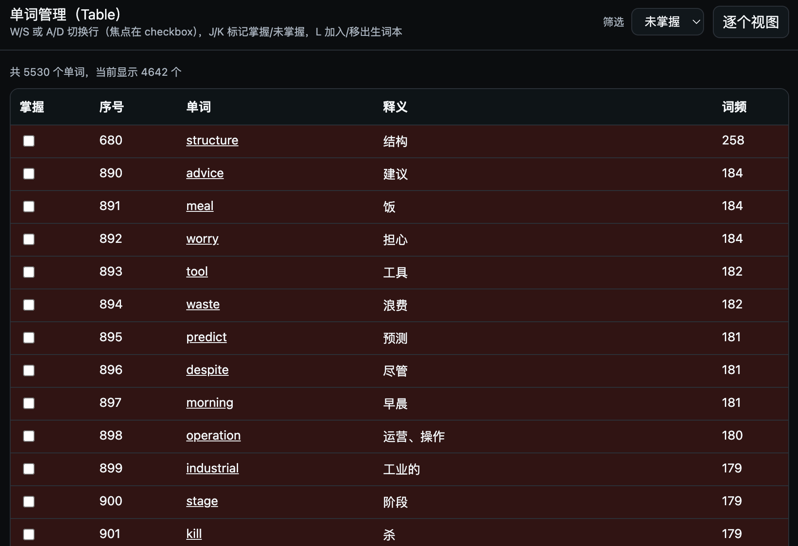
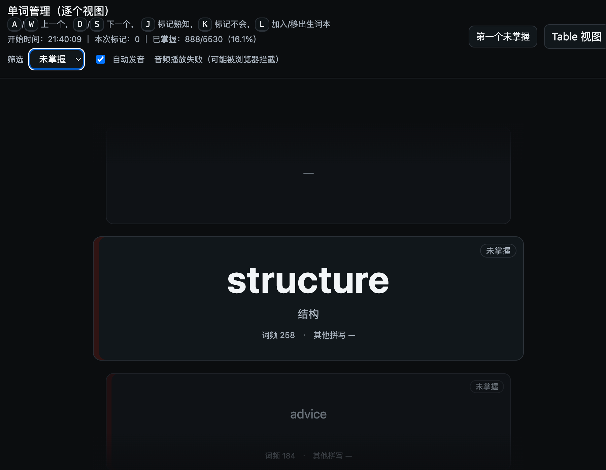

# VocabSprint（Deno）

一个本地运行的单词管理 Web 应用（Deno + 原生 HTML/JS/CSS），用于浏览词库、键盘快速标记掌握情况，并维护“生词本”。

## 预览

- Table 视图预览图：
- 逐个视图预览图：

## 功能

### 数据展示

- 读取 `netem_full_list.json` 并展示单词、释义、词频、其他拼写
- 支持两种视图：Table 列表视图 / 逐个（卡片）视图

### Table 视图

- 列表展示单词，checkbox 标记“已掌握/未掌握”，行背景色区分
- 键盘操作：
	- `W/S` 或 `A/D`：切换上一行/下一行（焦点始终在“掌握”checkbox）
	- `J/K`：将当前行标记为 已掌握/未掌握
	- `L`：加入/移出生词本
	- “打字机模式”：按 `A/D` 切换时自动将下一行滚动到视口居中
- 筛选：全部 / 已掌握 / 未掌握 / 生词

### 逐个（卡片）视图

- 类 Apple 的居中滚动选择器布局：上一个 / 当前 / 下一个
- 显示 metadata：词频、其他拼写；并用角标 + 左侧色条表达掌握状态
- 键盘操作：
	- `A/W`：上一个
	- `D/S`：下一个
	- `J`：标记熟知（已掌握），并自动切换到下一个
	- `K`：标记不会（未掌握），并自动切换到下一个
	- `L`：加入/移出生词本
- 统计信息：开始时间 / 本次标记数量 / 已掌握比例
- 一键跳转：跳到“第一个未掌握”
- 自动发音（可开关，localStorage 记忆）：使用有道发音接口
	- `https://dict.youdao.com/dictvoice?audio=<word>&type=2`
	- 注意：浏览器通常需要一次用户交互（键盘/点击）后才允许自动播放
- 筛选：全部 / 已掌握 / 未掌握 / 生词（筛选后 prev/next 会在筛选集合内切换）

## 运行（binary）

下载对应平台的 Release 二进制包，解压后直接运行：

- Windows：双击 `vocab-sprint.exe` 或在命令行执行 `vocab-sprint.exe`
- macOS / Linux：在终端执行 `./vocab-sprint`

## 运行（deno dev）

在本目录执行：

- `deno task dev`

然后打开：

- http://localhost:8000/table
- http://localhost:8000/card

## CLI（参数 & 环境变量）

入口文件是 `cli.ts`。

查看帮助：

- `deno task start -- --help`

## 数据与状态存储

- 词库数据：`./netem_full_list.json`
- 状态存储：Deno KV（默认路径 `./data/kv`）
	- 已掌握：`mastered`
	- 生词本：`vocab`

## Credit

- 词库数据来源：[NETEM - 考研词汇词频排序数据](https://github.com/exam-data/NETEMVocabulary)
- 发音接口来源：[有道词典](https://dict.youdao.com/)

## License

MIT License © 2024-Present